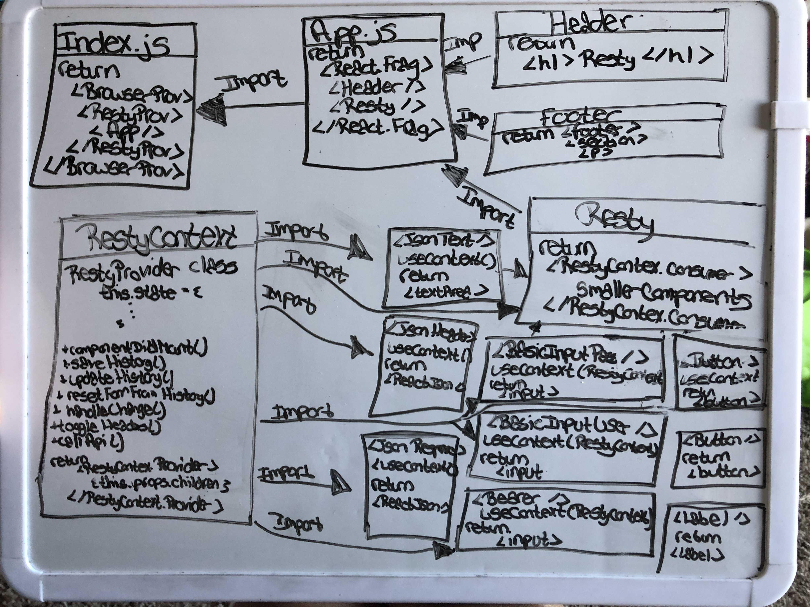

# RESTy-Context

### Author: Tia Rose

### Links and Resources
* [PR]()
* [AWS](http://resty-redux.s3-website-us-west-2.amazonaws.com)


#### Documentation
* `npx styleguidist server` - localhost:6060

#### EndPoints
`GET /api/v1/models` - A list of all data models

`GET /api/v1/:model/schema` - Retrieve the JSON schema from a given model

`GET /api/v1/:model/id` - Retrieve a single record with the id from a model

`DELETE /api/v1/:model/id` - Delete a single record with the id from a model

`PUT /api/v1/:model/id` - Update a single record with the id from a model

### File Structure (Target)

```
├── package.json
├── package-lock.json
├──.gitignore
├── README.md
├── public
│   └── index.html
├── assets
|   └──RestyContext.JPG
└── src
    ├── app.js
    ├── index.js
    ├── components
    |   ├── authorization
    |   |   └──basic
    |   |       ├──basic.md
    |   |       ├──basicInputPass.js
    |   |       ├──basicInputUser.js
    |   |   └──bearer
    |   |       ├──bearer.md
    |   |       ├──index.js
    |   |   ├──button.js
    |   |   ├──button.md
    |   ├── button
    |   |   └── button.md
    |   |   └── index.js
    │   ├── footer
    │   │   └── index.js
    │   ├── header
    │   │   └── index.js
    |   ├── jsonText
    |   |   └── index.js
    |   |   └── jsonText.md
    |   ├── jsonView
    |   |   └── header.js
    |   |   └── response.js
    │   ├── label
    │   │   └── index.js
    │   │   └── label.md
    │   └── resty
    │       ├── index.js
    │       ├── resty.css
    ├── lib
    │   ├── api.js
    │   └── utils.js
    ├── Context
    │   ├── restyContext.js
    │
    └── style
        ├── reset.css
        └── style.css
```


#### Running the app
* `npm i`
* `npm start`
  
#### Tests
* How do you run tests?
* `npm test`

#### UML
## Context


